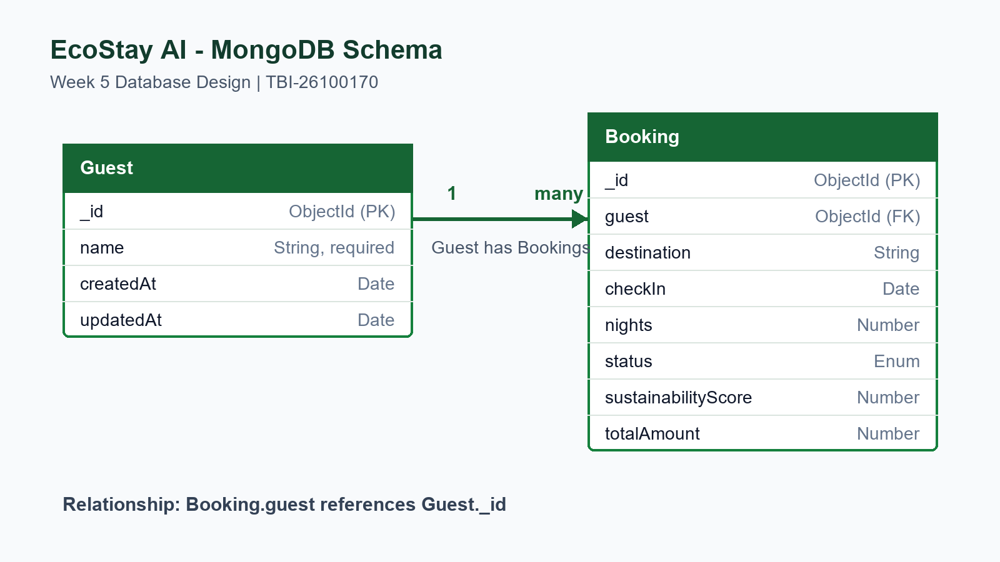

# EcoStay AI - Smart Homestay & Travel Assistant

EcoStay AI is a full-stack homestay booking dashboard built with React, Express, MongoDB Atlas, and Groq. The Week 7 version adds a protected AI assistant for itinerary planning, listing writing, and guest review insights.

## Tech Stack

- React 18, Vite, Tailwind CSS, React Router
- Node.js, Express, Mongoose
- MongoDB Atlas
- CORS, dotenv, bcrypt, JWT, Passport GitHub OAuth
- Groq API for AI-generated travel and homestay assistance

## Database Choice

MongoDB Atlas was selected because EcoStay booking records are naturally represented as documents and may gain flexible travel or sustainability fields later. Mongoose provides schema validation, references, indexes, timestamps, and a clean migration path from the Week 4 Express API.

## Schema



- One `Guest` can have many `Booking` records.
- `Booking.guest` stores an ObjectId reference to `Guest`.
- Guest names, destinations, booking dates, and statuses are indexed for common dashboard access patterns.

## Features

- Persistent MongoDB Atlas storage
- Create, read, update, delete, and search booking records
- Live dashboard statistics calculated by MongoDB aggregation
- Server-side payload and ObjectId validation
- Correct HTTP status codes and centralized error handling
- Configurable CORS for local and deployed frontends
- Responsive light/dark frontend
- Register, login, logout, authenticated profile, and protected dashboard
- Password hashing with bcrypt
- JWT authentication for protected API routes
- GitHub OAuth login support
- Rate-limited and validated authentication endpoints
- Protected AI assistant with itinerary planning, listing copy generation, and guest review insights

## Folder Structure

```text
backend/
  config/
    db.js
  models/
    Booking.js
    Guest.js
    User.js
  middleware/
    auth.js
  routes/
    auth.js
  .env.example
  package.json
  server.js
docs/
  W5_SchemaDiagram_TBI-26100170.png
src/
  components/
  context/
  pages/
    Dashboard.jsx
  App.jsx
  main.jsx
```

## Set Up the Database

1. Create a free M0 cluster at MongoDB Atlas.
2. Create a database user under **Database Access**.
3. In **Network Access**, allow your current IP address.
4. Open **Connect > Drivers** and copy the Node.js connection string.
5. In `backend`, copy `.env.example` to `.env`.
6. Replace the placeholders in `MONGO_URI` with the Atlas username, password, and cluster URL.
7. Keep `.env` private. It is ignored by Git and must never be committed.

Example:

```env
PORT=5000
FRONTEND_ORIGIN=http://localhost:5173,https://ecostay-ai.vercel.app
FRONTEND_URL=http://localhost:5173
MONGO_URI=mongodb+srv://<username>:<password>@<cluster-url>/ecostay?retryWrites=true&w=majority
JWT_SECRET=replace-with-a-long-random-secret
JWT_EXPIRES_IN=7d
GITHUB_CLIENT_ID=replace-with-github-oauth-client-id
GITHUB_CLIENT_SECRET=replace-with-github-oauth-client-secret
GITHUB_CALLBACK_URL=http://localhost:5000/api/auth/github/callback
GROQ_API_KEY=replace-with-groq-api-key
GROQ_MODEL=llama-3.1-8b-instant
```

If the password contains reserved URL characters, URL-encode it before adding it to the URI.

## Run Locally

Backend:

```bash
cd backend
npm install
copy .env.example .env
npm run dev
```

Frontend, in a second terminal:

```bash
npm install
npm run dev
```

The frontend runs at `http://localhost:5173` and the API at `http://localhost:5000/api`.

For a non-local backend, create a root `.env.local` file:

```env
VITE_API_URL=https://your-api-host.example/api
```

## API Endpoints

| Method | Endpoint | Description | Success |
|---|---|---|---|
| GET | `/api/health` | API and database health | `200` |
| POST | `/api/auth/register` | Create a user and return JWT | `201` |
| POST | `/api/auth/login` | Login and return JWT | `200` |
| GET | `/api/auth/me` | Return logged-in user | `200` |
| POST | `/api/auth/logout` | Logout acknowledgement | `200` |
| GET | `/api/auth/github` | Start GitHub OAuth login | `302` |
| GET | `/api/auth/github/callback` | Complete GitHub OAuth login | `302` |
| POST | `/api/ai/itinerary` | Generate an eco-friendly travel itinerary, protected | `200` |
| POST | `/api/ai/listing-description` | Generate homestay listing copy, protected | `200` |
| POST | `/api/ai/review-insights` | Analyze guest review sentiment and actions, protected | `200` |
| GET | `/api/bookings` | List bookings, protected | `200` |
| GET | `/api/bookings/:id` | Read one booking, protected | `200` |
| GET | `/api/bookings/search?q=munnar` | Search bookings, protected | `200` |
| GET | `/api/bookings/stats` | Aggregated dashboard statistics, protected | `200` |
| POST | `/api/bookings` | Create a booking, protected | `201` |
| PUT | `/api/bookings/:id` | Update supplied booking fields, protected | `200` |
| DELETE | `/api/bookings/:id` | Delete a booking, protected | `204` |

Invalid payloads and IDs return `400`, missing or invalid tokens return `401`, missing records return `404`, unconfigured OAuth returns `501`, blocked origins return `403`, rate-limited auth attempts return `429`, and unexpected failures return `500`.

Protected booking endpoints require:

```http
Authorization: Bearer <jwt-token>
```

### Authentication Payloads

Register:

```json
{
  "name": "Ashish Kumar",
  "email": "ashish@example.com",
  "password": "Week6Pass123"
}
```

Login:

```json
{
  "email": "ashish@example.com",
  "password": "Week6Pass123"
}
```

Passwords are stored as bcrypt hashes in MongoDB. JWT tokens are signed with `JWT_SECRET` and expire according to `JWT_EXPIRES_IN`.

## Frontend Auth Flow

- `/login` supports both register and login.
- `/dashboard` is protected and redirects unauthenticated users to `/login`.
- `/ai-assistant` is protected and redirects unauthenticated users to `/login`.
- `/profile` is protected and redirects unauthenticated users to `/login`.
- `/oauth/callback` completes the GitHub OAuth redirect and stores the JWT session.
- The dashboard sends the JWT in the `Authorization` header for booking CRUD requests.

## Week 7 AI Features

The AI assistant is available at `/ai-assistant` after login. It calls backend routes only, so the Groq API key stays in `backend/.env` and is never exposed to the frontend.

- **Itinerary Planner:** creates day-wise eco-friendly travel plans from destination, nights, budget, and travel style.
- **Listing Writer:** generates a homestay title, listing description, and short highlights from property details.
- **Review Insights:** analyzes guest feedback and returns sentiment, issues, improvement actions, and a polite owner reply.

If an AI request fails, the frontend shows a toast error. During generation, the page displays the Week 3 loader component.

### Booking Payload

```json
{
  "guestName": "Test Guest",
  "destination": "Munnar, Kerala",
  "checkIn": "2026-08-01",
  "nights": 2,
  "status": "confirmed",
  "sustainabilityScore": 88,
  "totalAmount": 10000
}
```

## Build

```bash
npm run build
```

## Week 5 Deliverables

- Database-backed source code and Mongoose models in this repository
- `W5_SchemaDiagram_TBI-26100170.pdf`
- `W5_CRUDVerification_TBI-26100170.pdf`
- Month-1 reflection video link submitted separately as an unlisted YouTube URL

## Week 6 Deliverables

- Auth-enabled source code in this repository
- `W6_AuthFlowScreenshots_TBI-26100170.pdf`
- `W6_AuthAPICollection_TBI-26100170.json`
- Consolidated submission zip: `W6_Submission_TBI-26100170.zip`

## Week 7 Deliverables

- AI-enabled source code in this repository
- `PROMPTS.md`
- `W7_AIFeatureDemo_TBI-26100170.pdf`
- GitHub commit message: `feat: integrate Groq AI assistant with loading and error states`
