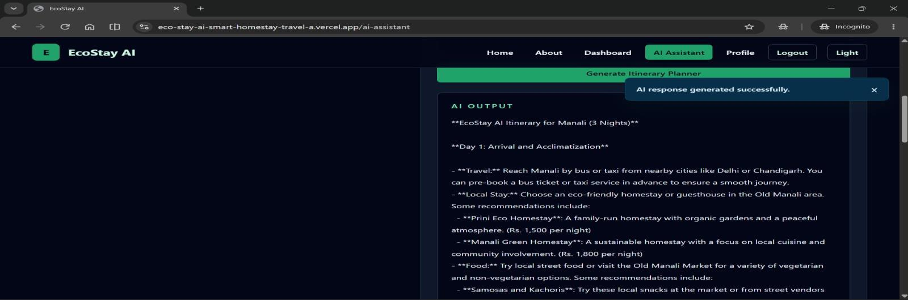
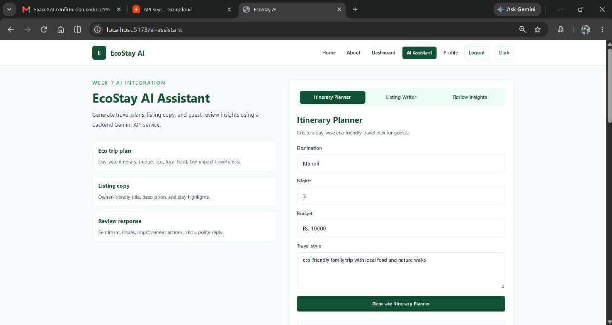
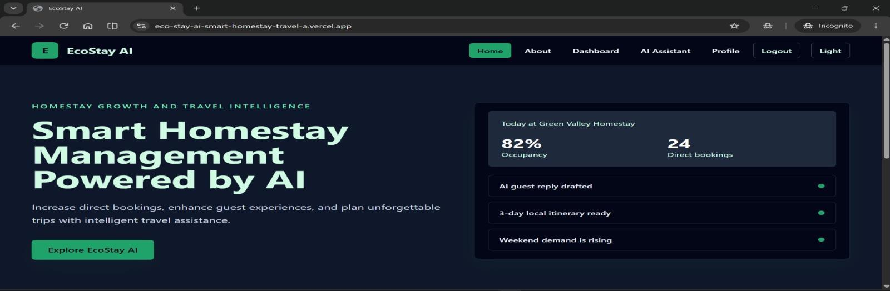
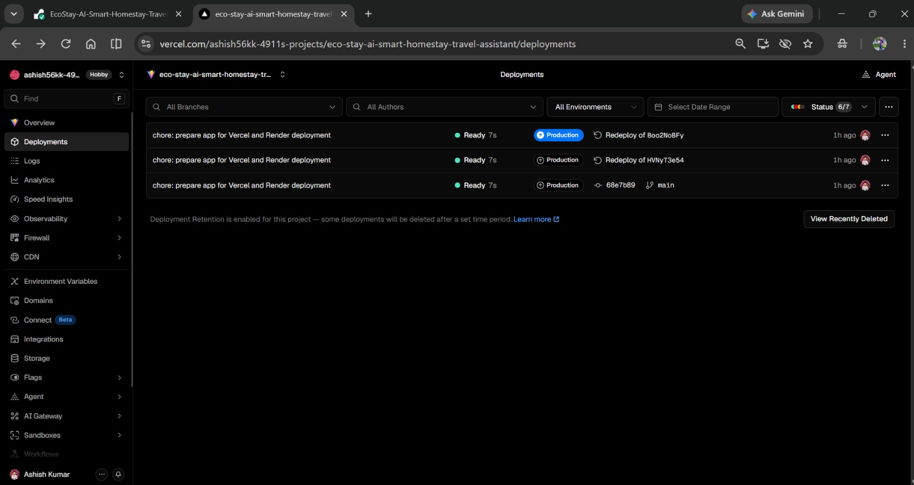

# EcoStay AI - Smart Homestay and Travel Assistant

EcoStay AI is a full-stack application for homestay owners to manage bookings and use AI for eco-friendly guest travel planning, listing copy, and review insights.

## Live Demo

- Frontend: [EcoStay AI on Vercel](https://eco-stay-ai-smart-homestay-travel-a.vercel.app/)
- Backend health check: [EcoStay API on Render](https://ecostay-ai-smart-homestay-travel.onrender.com/api/health)

## Demo Video

No demo video is included because it is not required for the current Week 10 submission.

## Screenshots

### Booking dashboard



### AI itinerary assistant



### Protected authentication flow



### Production deployment



## Features

- Register, login, logout, JWT sessions, and protected frontend routes
- Create, search, update, and delete homestay booking records
- Live booking statistics and sustainability score summaries from MongoDB
- Input validation, centralized error handling, CORS configuration, and auth rate limiting
- AI itinerary planner for destination, stay length, budget, and travel style
- AI listing writer for homestay owners
- AI guest review insights with sentiment, actions, and a suggested reply
- Responsive, accessible light and dark interface with clear loading, empty, and error states

## Tech Stack

| Layer | Technology | Why it was used |
|---|---|---|
| Frontend | React, Vite, React Router, Tailwind CSS | Fast SPA development, reusable UI, and responsive styling |
| Backend | Node.js, Express | Lightweight REST API and middleware support |
| Database | MongoDB Atlas with Mongoose | Flexible document data with schema validation and cloud hosting |
| Security | bcrypt, JWT, express-rate-limit | Password hashing, protected routes, and basic abuse protection |
| AI | Groq API with `llama-3.1-8b-instant` | Fast text generation for travel and homestay tasks |
| Hosting | Vercel and Render | Separate production hosting for frontend and API |

## Setup Instructions

### 1. Clone and install

```bash
git clone https://github.com/ashishkumar7020/EcoStay-AI-Smart-Homestay-Travel-Assistant.git
cd EcoStay-AI-Smart-Homestay-Travel-Assistant
npm install
cd backend
npm install
```

### 2. Configure environment variables

Create `backend/.env` from `backend/.env.example`.

```env
PORT=5000
NODE_ENV=development
FRONTEND_ORIGIN=http://localhost:5173
FRONTEND_URL=http://localhost:5173
MONGO_URI=mongodb+srv://<username>:<password>@<cluster-url>/ecostay?retryWrites=true&w=majority
JWT_SECRET=replace-with-a-long-random-secret
JWT_EXPIRES_IN=7d
GROQ_API_KEY=replace-with-groq-api-key
GROQ_MODEL=llama-3.1-8b-instant
```

Optional GitHub OAuth variables are also documented in `backend/.env.example`. Keep every secret in `.env`; do not commit it.

For a deployed backend, create a root `.env.local` file:

```env
VITE_API_URL=https://your-render-service.onrender.com/api
```

### 3. Run locally

Start the backend in one terminal:

```bash
cd backend
npm run dev
```

Start the frontend in another terminal:

```bash
npm run dev
```

Open `http://localhost:5173`.

## API Documentation

All protected endpoints require:

```http
Authorization: Bearer <jwt-token>
```

| Method | Endpoint | Purpose | Typical response |
|---|---|---|---|
| POST | `/api/auth/register` | Create a user and return a JWT | `201 Created` |
| POST | `/api/auth/login` | Authenticate a user and return a JWT | `200 OK` |
| GET | `/api/auth/me` | Return the current authenticated user | `200 OK` |
| GET | `/api/bookings` | List a user's booking records | `200 OK` |
| POST | `/api/bookings` | Create a booking | `201 Created` |
| PUT | `/api/bookings/:id` | Update a booking | `200 OK` |
| DELETE | `/api/bookings/:id` | Delete a booking | `204 No Content` |
| GET | `/api/bookings/stats` | Return booking and eco-score statistics | `200 OK` |
| POST | `/api/ai/itinerary` | Generate an eco-friendly itinerary | `200 OK` |
| POST | `/api/ai/listing-description` | Generate listing copy | `200 OK` |
| POST | `/api/ai/review-insights` | Analyze a guest review | `200 OK` |

Example registration request:

```json
{
  "name": "Ashish Kumar",
  "email": "ashish@example.com",
  "password": "Week6Pass123"
}
```

Example booking request:

```json
{
  "guestName": "Test Guest",
  "destination": "Munnar, Kerala",
  "checkIn": "2026-08-01",
  "nights": 2,
  "status": "confirmed",
  "sustainabilityScore": 88,
  "totalAmount": 10000
}
```

Validation errors return `400`, missing or invalid tokens return `401`, missing records return `404`, rate-limited auth requests return `429`, and unexpected server errors return `500`.

## Architecture and Folder Structure

```text
EcoStay-AI-Smart-Homestay-Travel-Assistant/
├── src/                    # React pages, components, and auth context
├── backend/
│   ├── config/             # MongoDB connection
│   ├── middleware/         # Authentication and validation middleware
│   ├── models/             # User, Guest, and Booking Mongoose models
│   └── routes/             # Auth, booking, and AI REST endpoints
├── docs/images/            # README screenshots
├── render.yaml             # Render backend configuration
└── vercel.json             # Vercel SPA rewrite configuration
```

The React frontend calls the Express REST API. Express validates requests, checks JWTs for protected routes, stores bookings in MongoDB Atlas, and calls Groq only from the backend so the AI key remains private.

## Database Schema

- `User`: name, email, password hash, provider, timestamps
- `Guest`: guest information used by bookings
- `Booking`: guest reference, destination, check-in date, nights, status, sustainability score, and amount

MongoDB Atlas was selected because the booking record can grow with flexible travel and sustainability fields while Mongoose still enforces required fields and validation.

## Known Limitations

- Render's free service may take time to wake after inactivity.
- AI output depends on the configured Groq API key and provider availability.
- GitHub OAuth requires the optional OAuth variables and correct production callback URL.
- The application is a student project and does not include payment processing or role-based owner teams.

## Credits and Acknowledgements

- MongoDB Atlas for managed database hosting
- Groq for LLM inference
- Vercel and Render for deployment
- React, Express, Tailwind CSS, Mongoose, bcrypt, JWT, and Passport open-source communities

